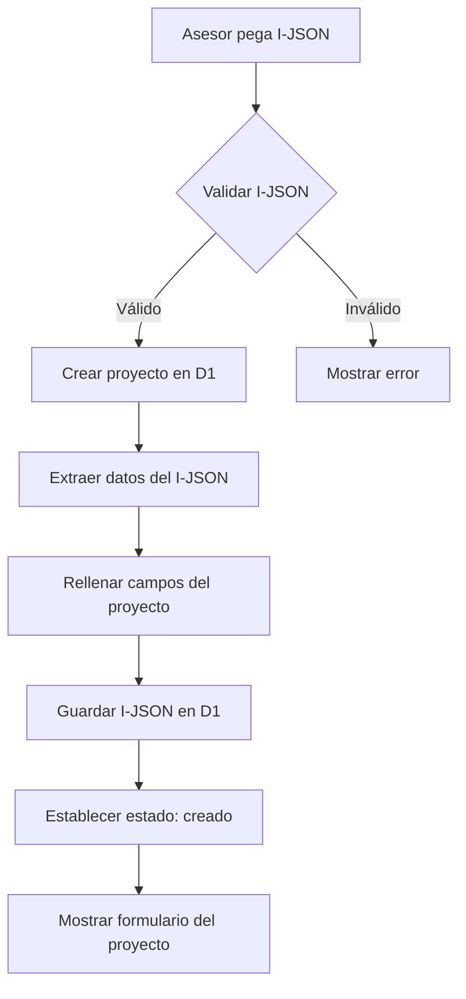
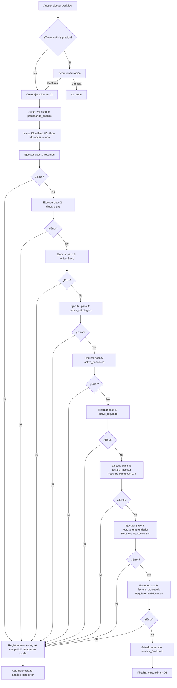
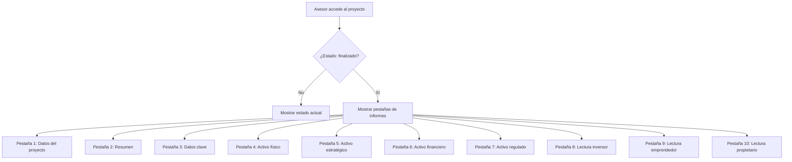

# Especificación: Workflow de Análisis Inmobiliario

> **Documento:** FASE 2 — Definición
> **Fuente principal:** [`01 vision.md`](../fase01/01%20vision.md)
> **Versión:** 1.1
> **Fecha:** 2026-03-18
> **Cambio:** Actualizado para reflejar integración con Cloudflare Workflows y OpenAI Responses API

---

## Resumen

Esta especificación define la funcionalidad principal del MVP de VaaIA: la ejecución de un workflow de análisis inmobiliario que convierte un anuncio en formato JSON (I-JSON) en informes estructurados generados por IA.

---

## Objetivo

Permitir a los asesores inmobiliarios ejecutar un análisis estructurado y completo de un inmueble a partir de un anuncio inmobiliario en formato JSON, generando informes multidimensionales que sirvan como base para decisiones de negocio.

---

## Alcance

### Incluido

- Creación de proyectos a partir de I-JSON
- Ejecución secuencial del workflow de 9 pasos
- Generación de informes Markdown para cada paso
- Almacenamiento de resultados en D1 (datos) y R2 (archivos)
- Gestión de estados del proyecto
- Visualización de resultados en interfaz

### Excluido

- Ejecución parcial por módulos del workflow
- Relanzamiento aislado de un único análisis
- Versionado de prompts o resultados
- Comparadores complejos de escenarios
- Automatización masiva de captura de múltiples anuncios
- Producto orientado plenamente a cliente final

---

## Entidades del Dominio

### Proyecto (PYT)

| Atributo | Tipo | Descripción |
|-----------|-------|-------------|
| `id` | String (UUID) | Identificador único del proyecto |
| `nombre` | String | Nombre del proyecto (extraído del I-JSON) |
| `descripcion` | String | Descripción del proyecto (extraída del I-JSON) |
| `i_json` | JSON | Contenido completo del I-JSON del anuncio |
| `estado` | Enum | Estado del proyecto (ver sección Estados) |
| `asesor_responsable` | String | Identificador del asesor responsable |
| `fecha_creacion` | DateTime | Fecha y hora de creación del proyecto |
| `fecha_actualizacion` | DateTime | Fecha y hora de última actualización |
| `fecha_analisis_inicio` | DateTime | Fecha y hora de inicio del análisis |
| `fecha_analisis_fin` | DateTime | Fecha y hora de finalización del análisis |

### Ejecución de Workflow

| Atributo | Tipo | Descripción |
|-----------|-------|-------------|
| `id` | String (UUID) | Identificador único de la ejecución |
| `proyecto_id` | String (FK) | Referencia al proyecto asociado |
| `estado` | Enum | Estado de la ejecución (ver sección Estados) |
| `fecha_inicio` | DateTime | Fecha y hora de inicio de la ejecución |
| `fecha_fin` | DateTime | Fecha y hora de finalización de la ejecución |
| `error_mensaje` | String | Mensaje de error si la ejecución falló |

### Paso de Workflow

| Atributo | Tipo | Descripción |
|-----------|-------|-------------|
| `id` | String (UUID) | Identificador único del paso |
| `ejecucion_id` | String (FK) | Referencia a la ejecución asociada |
| `tipo_paso` | Enum | Tipo de paso (ver sección Tipos de Paso) |
| `orden` | Integer | Orden secuencial del paso en el workflow |
| `estado` | Enum | Estado del paso (ver sección Estados) |
| `fecha_inicio` | DateTime | Fecha y hora de inicio del paso |
| `fecha_fin` | DateTime | Fecha y hora de finalización del paso |
| `error_mensaje` | String | Mensaje de error si el paso falló |
| `ruta_archivo_r2` | String | Ruta del archivo Markdown generado en R2 |

### Instrucción de Workflow

| Atributo | Tipo | Descripción |
|-----------|-------|-------------|
| `id` | Integer | Identificador único de la instrucción |
| `nombre` | String | Nombre descriptivo de la instrucción |
| `version` | Integer | Versión de la instrucción |
| `activa` | Boolean | Indica si la instrucción está activa |
| `modelo` | String | Modelo de OpenAI a utilizar |
| `temperatura` | Float | Temperatura para la generación |
| `max_tokens` | Integer | Máximo de tokens de salida |
| `formato_salida` | String | Formato de salida esperado |
| `tipo_entrada` | String | Tipo de entrada (json o json_mas_markdown) |
| `prompt_desarrollador` | Text | Texto completo de la instrucción |
| `notas` | String | Notas sobre cambios o ajustes |
| `fecha_vigencia` | DateTime | Fecha de vigencia de la configuración |

---

## Estados

### Estados del Proyecto

| Estado | Descripción | Transiciones desde |
|---------|-------------|-------------------|
| `creado` | Proyecto creado, listo para ejecutar análisis | Inicial |
| `procesando_analisis` | Análisis en ejecución | `creado`, `analisis_con_error` |
| `analisis_con_error` | Análisis completado con errores | `procesando_analisis` |
| `analisis_finalizado` | Análisis completado exitosamente | `procesando_analisis` |

### Estados de Ejecución

| Estado | Descripción | Transiciones desde |
|---------|-------------|-------------------|
| `iniciada` | Ejecución iniciada | Inicial |
| `en_ejecucion` | Ejecución en progreso | `iniciada` |
| `finalizada_correctamente` | Ejecución completada sin errores | `en_ejecucion` |
| `finalizada_con_error` | Ejecución completada con errores | `en_ejecucion` |

### Estados de Paso

| Estado | Descripción |
|---------|-------------|
| `pendiente` | Paso pendiente de ejecución |
| `en_ejecucion` | Paso en ejecución |
| `correcto` | Paso completado exitosamente |
| `error` | Paso completado con error |

---

## Tipos de Paso

| Tipo | Descripción | Salida esperada | Entrada requerida |
|-------|-------------|------------------|-------------------|
| `resumen` | Generación de resumen del inmueble | Markdown: Resumen | I-JSON |
| `datos_clave` | Generación de datos clave del inmueble | Markdown: Datos clave | I-JSON |
| `activo_fisico` | Análisis físico del inmueble | Markdown: Activo físico | I-JSON |
| `activo_estrategico` | Análisis estratégico del inmueble | Markdown: Activo estratégico | I-JSON |
| `activo_financiero` | Análisis financiero del inmueble | Markdown: Activo financiero | I-JSON |
| `activo_regulado` | Análisis regulatorio del inmueble | Markdown: Activo regulado | I-JSON |
| `lectura_inversor` | Análisis para perfil inversor | Markdown: Lectura inversor | I-JSON + Markdown 1-4 |
| `lectura_emprendedor` | Análisis para perfil emprendedor/operador | Markdown: Lectura emprendedor | I-JSON + Markdown 1-4 |
| `lectura_propietario` | Análisis para perfil propietario | Markdown: Lectura propietario | I-JSON + Markdown 1-4 |

**Nota:** Los pasos 7-9 (`lectura_inversor`, `lectura_emprendedor`, `lectura_propietario`) requieren como entrada el I-JSON más los Markdown generados en los pasos 1-4 (`resumen`, `datos_clave`, `activo_fisico`, `activo_estrategico`).

---

## Reglas de Negocio

### RB-01: Ejecución Completa del Workflow

El workflow debe ejecutar **siempre todos los pasos** en orden secuencial. No se permite ejecución parcial por módulos ni relanzamiento de un único análisis.

### RB-02: Validación de I-JSON

Antes de crear un proyecto, el sistema debe validar que el I-JSON:
- Sea un JSON válido sintácticamente
- Contenga los campos mínimos requeridos (ver sección Validaciones)

### RB-03: Confirmación de Reejecución

Si el proyecto ya tiene análisis previos, el sistema debe pedir confirmación al usuario antes de ejecutar el workflow nuevamente.

### RB-04: Sustitución de Resultados en Reejecución

En caso de reejecución del workflow:
- Se deben **borrar todos los archivos Markdown** existentes
- Se debe **conservar el archivo JSON** original
- Se deben **ejecutar todos los pasos** nuevamente

### RB-05: Reejecución Automática tras Error

Si el estado del proyecto es `analisis_con_error`, el sistema debe permitir reejecución sin pedir confirmación al usuario.

### RB-06: Detención ante Error

Si cualquier paso del workflow falla:
- El proceso debe **detenerse inmediatamente**
- No se deben ejecutar los pasos siguientes
- El estado del proyecto debe pasar a `analisis_con_error`
- El error debe mostrarse al usuario de forma tipificada

### RB-07: Almacenamiento en R2

Para cada proyecto, en R2 se debe crear una **carpeta exclusiva** con la siguiente estructura:

```
r2-almacen/dir-api-inmo/{proyecto_id}/
├── {proyecto_id}.json          # I-JSON completo (se conserva entre reejecuciones)
├── resumen.md
├── datos_clave.md
├── activo_fisico.md
├── activo_estrategico.md
├── activo_financiero.md
├── activo_regulado.md
├── lectura_inversor.md
├── lectura_emprendedor.md
├── lectura_propietario.md
└── log.txt                      # Registro de errores y auditoría
```

### RB-08: Registro de Errores y Auditoría

Si se produce un error en cualquier paso:
- Se debe registrar el error en `log.txt`
- El registro debe incluir: fecha, paso, mensaje de error, stack trace si aplica
- Se debe registrar la petición y respuesta cruda de OpenAI API para auditoría

### RB-09: Actualización de Estados

El estado del proyecto debe actualizarse en los siguientes momentos:
- Al crear el proyecto: `creado`
- Al iniciar el workflow: `procesando_analisis`
- Al completar el workflow sin errores: `analisis_finalizado`
- Al producirse un error: `analisis_con_error`

### RB-10: Configuración de Instrucciones

Las instrucciones para cada paso del workflow deben:
- Estar almacenadas en la tabla `ani_instrucciones` en D1
- Ser configurables sin requerir redeploy del Worker
- Incluir parámetros de OpenAI (modelo, temperatura, max_tokens)
- Estar marcadas como activas para ser ejecutadas

### RB-11: Entradas para Pasos 7-9

Los pasos 7-9 del workflow (`lectura_inversor`, `lectura_emprendedor`, `lectura_propietario`) deben:
- Recibir como entrada el I-JSON del proyecto
- Recibir los Markdown generados en los pasos 1-4 (`resumen`, `datos_clave`, `activo_fisico`, `activo_estrategico`)
- Validar que los Markdown previos existen antes de ejecutarse
- Detener el workflow si los Markdown previos no están disponibles

### RB-12: Idempotencia de Pasos

Cada paso del workflow debe ser idempotente, permitiendo:
- Reintentos sin efectos secundarios no deseados
- Verificar si ya se generó la salida antes de invocar OpenAI API nuevamente
- Escritura controlada en R2 o D1

### RB-13: Reintentos Automáticos

Los reintentos automáticos deben ser manejados por Cloudflare Workflows:
- Cada paso puede reintentarse según la configuración del workflow
- Los reintentos deben respetar la idempotencia del paso
- Los errores deben registrarse en `log.txt` con información del reintento

---

## Flujos Principales

### Flujo 1: Crear Proyecto desde I-JSON



### Flujo 2: Ejecutar Workflow de Análisis



**Notas del Flujo 2:**
- Cada paso obtiene su configuración desde la tabla `ani_instrucciones` en D1
- Los pasos 1-6 reciben como entrada únicamente el I-JSON del proyecto
- Los pasos 7-9 reciben como entrada el I-JSON más los Markdown generados en los pasos 1-4
- Cada paso llama a OpenAI Responses API con los parámetros configurados (modelo: gpt-5.2, max_tokens: 4000, temperature: 0.7)
- Los reintentos automáticos son manejados por Cloudflare Workflows
- Los logs de auditoría (petición/respuesta cruda) se almacenan en `log.txt` en R2

### Flujo 3: Consultar Resultados



---

## Validaciones

### Validación de I-JSON

| Campo | Tipo | Obligatorio | Validación |
|-------|-------|-------------|-------------|
| `url_fuente` | String | No | URL válida |
| `portal_inmobiliario` | String | No | No vacío |
| `id_anuncio` | String | No | No vacío |
| `titulo_anuncio` | String | Sí | No vacío |
| `descripcion` | String | Sí | No vacío |
| `tipo_operacion` | String | Sí | Valores: venta, alquiler, traspaso |
| `tipo_inmueble` | String | Sí | Valores: local, piso, nave, etc. |
| `precio` | String | Sí | Número válido |
| `superficie_construida_m2` | String | No | Número válido |
| `ciudad` | String | Sí | València |
| `barrio` | String | No | No vacío |

---

## Inputs y Outputs

### Input: I-JSON

Formato JSON estructurado con la información completa del anuncio inmobiliario. Ver [`Ejemplo-modelo-info.json`](../fase01/Ejemplo-modelo-info.json) para referencia de estructura.

### Output: Informes Markdown

Cada paso del workflow genera un archivo Markdown con el análisis correspondiente:

| Paso | Archivo | Contenido |
|------|----------|------------|
| 1 | `resumen.md` | Resumen del inmueble |
| 2 | `datos_clave.md` | Datos clave del inmueble |
| 3 | `activo_fisico.md` | Análisis físico |
| 4 | `activo_estrategico.md` | Análisis estratégico |
| 5 | `activo_financiero.md` | Análisis financiero |
| 6 | `activo_regulado.md` | Análisis regulatorio |
| 7 | `lectura_inversor.md` | Lectura para inversor |
| 8 | `lectura_emprendedor.md` | Lectura para emprendedor/operador |
| 9 | `lectura_propietario.md` | Lectura para propietario |

---

## Edge Cases

| Caso | Comportamiento esperado |
|-------|----------------------|
| I-JSON mal formado | Mostrar error de validación al usuario |
| I-JSON incompleto | Crear proyecto con datos disponibles y marcar campos faltantes |
| Error en OpenAI Responses API | Detener workflow, registrar error en log.txt con petición/respuesta cruda, actualizar estado a `analisis_con_error` |
| Timeout en OpenAI Responses API | Detener workflow, registrar error en log.txt, actualizar estado a `analisis_con_error` |
| Reejecución con archivos corruptos en R2 | Sobrescribir archivos existentes sin preguntar |
| Usuario cancela ejecución en progreso | Detener workflow, mantener estado actual del proyecto |
| Instrucción no encontrada en ani_instrucciones | Detener workflow, registrar error en log.txt, actualizar estado a `analisis_con_error` |
| Instrucción inactiva en ani_instrucciones | Detener workflow, registrar error en log.txt, actualizar estado a `analisis_con_error` |
| Markdown previos no disponibles para pasos 7-9 | Detener workflow, registrar error en log.txt, actualizar estado a `analisis_con_error` |
| Error de conexión con Cloudflare Workflows | Notificar error al usuario, mantener estado actual del proyecto |

---

## Precondiciones y Postcondiciones

### Precondiciones Generales

- El usuario está autenticado en el sistema (en fases posteriores)
- El usuario tiene acceso a un I-JSON válido
- El sistema tiene configuración de OpenAI API (clave en KV)
- La tabla `ani_instrucciones` en D1 contiene las 9 instrucciones configuradas y activas

### Precondiciones por Flujo

| Flujo | Precondiciones |
|--------|----------------|
| Crear proyecto | Usuario tiene I-JSON válido |
| Ejecutar workflow | Proyecto existe, estado es `creado` o `analisis_con_error` |
| Consultar resultados | Proyecto existe, estado es `analisis_finalizado` |

### Postcondiciones Generales

- Los datos están persistidos en D1 (proyectos, ejecuciones, pasos)
- Los archivos están almacenados en R2 (I-JSON, informes Markdown, logs de auditoría)
- El estado del proyecto refleja la realidad actual
- Los logs de auditoría contienen petición/respuesta cruda de cada llamada a OpenAI API

### Postcondiciones por Flujo

| Flujo | Postcondiciones |
|--------|-----------------|
| Crear proyecto | Proyecto existe en D1, estado es `creado` |
| Ejecutar workflow (éxito) | Todos los informes Markdown generados, estado es `analisis_finalizado` |
| Ejecutar workflow (error) | Error registrado en log, estado es `analisis_con_error` |

---

## Supuestos

1. **Alcance geográfico:** El análisis se centra exclusivamente en València ciudad.
2. **Foco tipológico:** El sistema está optimizado para local comercial, reconversión/cambio de uso y pisos como oficinas.
3. **Instrucciones configurables:** Las instrucciones para OpenAI API se almacenan en la tabla `ani_instrucciones` en D1 y son configurables sin redeploy del Worker.
4. **Sin versionado:** No hay versionado de prompts ni de resultados. Cada reejecución sobrescribe lo anterior.
5. **Revisión humana:** Los resultados requieren revisión humana antes de tomar decisiones definitivas.
6. **Fuente única de verdad:** El I-JSON es la fuente única de verdad para el análisis. Si el anuncio cambia, se debe crear un nuevo proyecto.
7. **Workflow secuencial:** El workflow siempre ejecuta todos los 9 pasos en orden secuencial, sin ejecución parcial.

---

## Requisitos Funcionales

### RF-01: Orquestación con Cloudflare Workflows

El workflow de análisis debe implementarse como un Cloudflare Workflow (`wk-proceso-inmo`) que ejecute los 9 pasos secuencialmente mediante `step.do()`.

### RF-02: Configuración de Instrucciones en D1

Las instrucciones para cada paso del workflow deben almacenarse en la tabla `ani_instrucciones` en D1. Cada instrucción debe ser configurable sin requerir redeploy del Worker.

### RF-03: Parámetros de OpenAI

Cada instrucción debe incluir los siguientes parámetros configurables:
- **Modelo:** gpt-5.2
- **max_tokens:** 4000
- **temperature:** 0.7
- **prompt_desarrollador:** Texto de la instrucción
- **tipo_entrada:** Tipo de entrada esperada (json o json_mas_markdown)

### RF-04: Entradas para Pasos 1-6

Los pasos 1-6 del workflow deben recibir como entrada únicamente el I-JSON del proyecto.

### RF-05: Entradas para Pasos 7-9

Los pasos 7-9 del workflow deben recibir como entrada:
- El I-JSON del proyecto
- Los Markdown generados en los pasos 1-4 (resumen, datos_clave, activo_fisico, activo_estrategico)

### RF-06: Almacenamiento de Resultados en R2

Los resultados del workflow deben almacenarse en R2 con la siguiente estructura:
- I-JSON original: `{proyecto_id}.json`
- Informes Markdown: `{tipo_paso}.md` para cada paso
- Logs de auditoría: `log.txt` con petición/respuesta cruda de OpenAI

### RF-07: Logs de Auditoría

El sistema debe registrar en R2 (`log.txt`) la petición y respuesta cruda de cada llamada a OpenAI API para auditoría y debugging.

### RF-08: Integración con OpenAI Responses API

El workflow debe utilizar la Responses API de OpenAI para generar los informes Markdown, usando `instructions` y `input` según la documentación oficial.

---

## Requisitos No Funcionales

### RNF-01: Idempotencia de Pasos

Cada paso del workflow debe ser idempotente, permitiendo reintentos sin efectos secundarios no deseados.

### RNF-02: Reintentos Automáticos

Los reintentos automáticos deben ser manejados por Cloudflare Workflows, según la configuración de cada paso.

### RNF-03: Configuración Editable sin Redeploy

La configuración de las instrucciones en la tabla `ani_instrucciones` debe poder modificarse sin requerir redeploy del Worker.

### RNF-04: Logs de Auditoría en R2

Los logs de auditoría (petición/respuesta cruda) deben almacenarse en R2 para trazabilidad y debugging.

### RNF-05: Persistencia de Estado

El estado del workflow debe persistirse automáticamente por Cloudflare Workflows para manejar ejecuciones de larga duración.

### RNF-06: Manejo de Errores

El sistema debe capturar, registrar y comunicar errores de forma tipificada al usuario, deteniendo el workflow si es necesario.

---

## Requisitos de Configuración

### RC-01: Tabla ani_instrucciones

Debe existir una tabla `ani_instrucciones` en D1 para almacenar la configuración de las instrucciones del workflow.

#### Campos de la tabla ani_instrucciones

| Campo | Tipo | Descripción |
|-------|------|-------------|
| `id` | Integer | Identificador único de la instrucción |
| `nombre` | String | Nombre descriptivo de la instrucción |
| `version` | Integer | Versión de la instrucción |
| `activa` | Boolean | Indica si la instrucción está activa |
| `modelo` | String | Modelo de OpenAI a utilizar (ej: gpt-5.2) |
| `temperatura` | Float | Temperatura para la generación (ej: 0.7) |
| `max_tokens` | Integer | Máximo de tokens de salida (ej: 4000) |
| `formato_salida` | String | Formato de salida esperado (markdown) |
| `tipo_entrada` | String | Tipo de entrada (json o json_mas_markdown) |
| `prompt_desarrollador` | Text | Texto completo de la instrucción |
| `notas` | String | Notas sobre cambios o ajustes |
| `fecha_vigencia` | DateTime | Fecha de vigencia de la configuración |

### RC-02: Configuración Inicial de las 9 Instrucciones

Debe existir una configuración inicial para las 9 instrucciones del workflow:

| ID | Nombre | Tipo Entrada | Descripción |
|----|--------|--------------|-------------|
| 1 | resumen_ejecutivo_inmueble | json | Genera resumen del inmueble |
| 2 | datos_clave_inmueble | json | Genera datos clave del inmueble |
| 3 | analisis_fisico_inmueble | json | Genera análisis físico del inmueble |
| 4 | analisis_estrategico_inmueble | json | Genera análisis estratégico del inmueble |
| 5 | analisis_financiero_inmueble | json | Genera análisis financiero del inmueble |
| 6 | analisis_regulatorio_inmueble | json | Genera análisis regulatorio del inmueble |
| 7 | lectura_inversor | json_mas_markdown | Genera lectura para perfil inversor |
| 8 | lectura_emprendedor | json_mas_markdown | Genera lectura para perfil emprendedor |
| 9 | lectura_propietario | json_mas_markdown | Genera lectura para perfil propietario |

### RC-03: Parámetros por Defecto

Todos los pasos deben usar los siguientes parámetros por defecto:
- **Modelo:** gpt-5.2
- **max_tokens:** 4000
- **temperature:** 0.7
- **formato_salida:** markdown

---

## Requisitos Técnicos

### RT-01: Integración con Cloudflare Workflows

El workflow debe implementarse como un Cloudflare Workflow (`wk-proceso-inmo`) que ejecute los pasos secuencialmente mediante `step.do()`.

### RT-02: Integración con OpenAI Responses API

Cada paso debe llamar a la Responses API de OpenAI con las instrucciones correspondientes y el I-JSON como contexto (o I-JSON + Markdown previos para pasos 7-9).

### RT-03: Almacenamiento en D1

Los datos del proyecto, la trazabilidad de ejecuciones, pasos e instrucciones deben persistirse en D1.

### RT-04: Almacenamiento en R2

Los informes Markdown, el I-JSON y los logs de auditoría deben almacenarse en R2 con la estructura de carpetas definida.

### RT-05: Gestión de Estados

El sistema debe gestionar los estados del proyecto, ejecución y pasos según las transiciones definidas.

### RT-06: Manejo de Errores

El sistema debe capturar, registrar y comunicar errores de forma tipificada al usuario.

### RT-07: Secret Management

La clave de API de OpenAI debe almacenarse como secret en KV namespace `secrets-api-inmo`.

### RT-08: Bindings de Cloudflare

El Workflow Worker debe tener los siguientes bindings:
- D1: `CF_B_DB-INMO` (para ejecuciones, pasos, instrucciones)
- R2: `CF_B_R2_INMO` (para I-JSON, informes, logs)
- KV: `CF_B_KV_SECRETS` (para OPENAI_API_KEY)

---

> **Nota:** Esta especificación está basada en [`01 vision.md`](../fase01/01%20vision.md), [`02 problem-statement.md`](../fase01/02%20problem-statement.md), [`03 user-personas.md`](../fase01/03%20user-personas.md) y [`04 use-cases.md`](../fase01/04%20use-cases.md) como fuentes principales.
