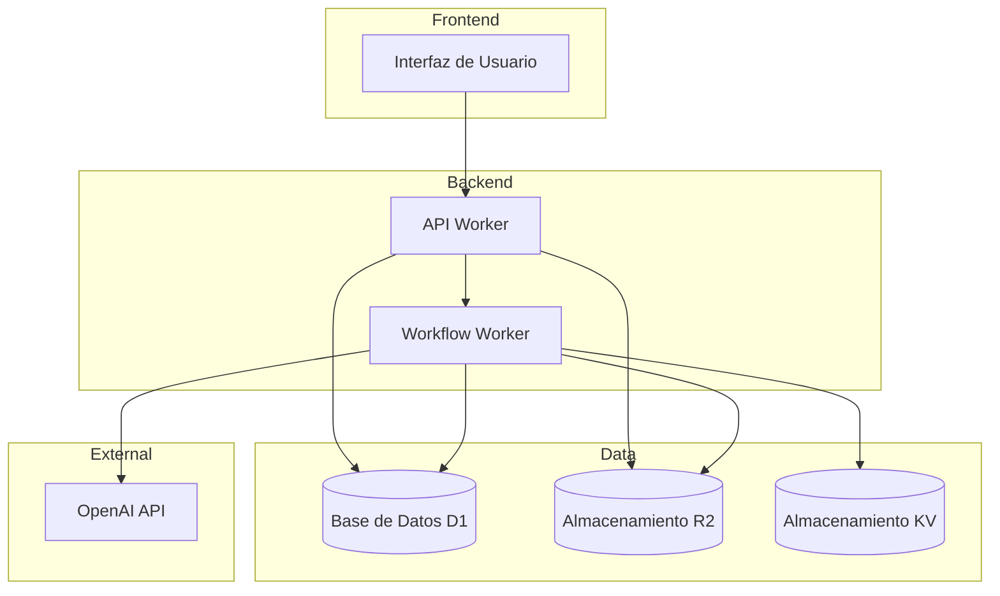
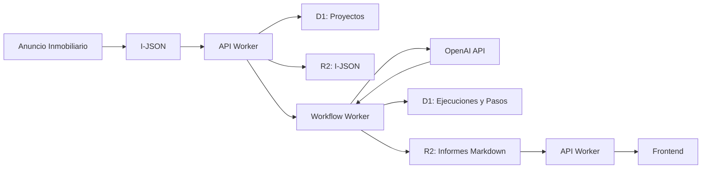

# Arquitectura del Sistema

> **Documento:** FASE 3 — Diseño  
> **Fuente principal:** [`01 feature-workflow-analisis.spec.md`](../fase02/01%20feature-workflow-analisis.spec.md)  
> **Versión:** 1.0  
> **Fecha:** 2026-03-18

---

## Resumen

Este documento describe la arquitectura general del sistema VaaIA, sus capas, componentes principales, responsabilidades y relaciones entre componentes.

---

## Visión General

VaaIA es una aplicación web analítica que permite a asesores inmobiliarios ejecutar análisis estructurados de inmuebles a partir de anuncios en formato JSON (I-JSON), utilizando IA para generar informes multidimensionales.

La arquitectura se basa en **Cloudflare Workers** como plataforma principal de computación, con **D1** para persistencia de datos y **R2** para almacenamiento de archivos.

---

## Capas del Sistema



---

## Descripción de Capas

### 1. Frontend (Interfaz de Usuario)

**Responsabilidad:** Proporcionar una interfaz web para que los asesores inmobiliarios puedan crear proyectos, ejecutar workflows y consultar resultados.

**Rol en el sistema:** SPA administrativa, panel interno, dashboard operacional.

**Tecnología:** React 19 + TypeScript + Tailwind CSS v4

**Base UI:** TailAdmin free-react-tailwind-admin-dashboard

**Funcionalidades:**
- Listado de proyectos
- Creación de proyectos (pegar I-JSON)
- Ejecución de workflows
- Visualización de resultados en pestañas
- Edición y eliminación de proyectos

**Comunicación:** REST API hacia el API Worker vía HTTP/JSON

**Patrones de respuesta:** `{ data: ... }` o `{ error: "..." }`

**Validación:** Validación de I-JSON en frontend antes de enviar a backend

---

### 2. Backend (API Worker)

**Responsabilidad:** Exponer endpoints REST para la gestión de proyectos y ejecución de workflows.

**Runtime objetivo:** Cloudflare Workers

**Framework HTTP:** Hono (propuesto/aceptado)

**Arquitectura:** Middleware, handlers, servicios, bindings

**Impacto en arquitectura:**
- Modelo de routing declarativo y type-safe
- Composición de middleware
- Patrón request/response
- Validación integrada
- Integración directa con Cloudflare Workers bindings

**Endpoints:**
- `GET /api/v1/proyectos` - Listar proyectos
- `POST /api/v1/proyectos` - Crear proyecto
- `GET /api/v1/proyectos/{proyecto_id}` - Obtener proyecto
- `PUT /api/v1/proyectos/{proyecto_id}` - Actualizar proyecto
- `DELETE /api/v1/proyectos/{proyecto_id}` - Eliminar proyecto
- `POST /api/v1/proyectos/{proyecto_id}/workflows/ejecutar` - Ejecutar workflow
- `GET /api/v1/proyectos/{proyecto_id}/workflows/ejecuciones` - Listar ejecuciones
- `GET /api/v1/proyectos/{proyecto_id}/workflows/ejecuciones/{ejecucion_id}` - Obtener ejecución
- `GET /api/v1/proyectos/{proyecto_id}/resultados` - Obtener resultados
- `GET /api/v1/proyectos/{proyecto_id}/resultados/{tipo_informe}` - Obtener informe específico

**Responsabilidades:**
- Validar I-JSON
- Crear y gestionar proyectos en D1
- Invocar el Workflow Worker
- Servir archivos desde R2
- Gestionar estados del proyecto

---

### 3. Workflow Worker

**Responsabilidad:** Ejecutar el workflow secuencial de 9 pasos de análisis, llamando a OpenAI API para cada paso.

**Tecnología:** Cloudflare Workflows con Responses API de OpenAI

**Pasos del Workflow:**
1. Resumen del inmueble
2. Datos clave del inmueble
3. Análisis físico
4. Análisis estratégico
5. Análisis financiero
6. Análisis regulatorio
7. Lectura para inversor
8. Lectura para emprendedor
9. Lectura para propietario

**Integración con OpenAI:**
- **API:** Responses API de OpenAI (recomendado por OpenAI para nuevos proyectos)
- **Modelo:** gpt-5.2
- **max_tokens:** 4000
- **temperature:** 0.7

**Configuración de Instrucciones:**
- Las instrucciones se almacenan en la tabla `ani_instrucciones` en D1
- Cada instrucción incluye: modelo, temperatura, prompt desarrollador, tipo de entrada
- Las instrucciones son configurables sin redeploy del Worker

**Almacenamiento de Resultados:**
- El I-JSON original se almacena en R2
- Los informes Markdown generados se almacenan en R2
- Los logs de auditoría (petición/respuesta cruda) se almacenan en R2

**Responsabilidades:**
- Ejecutar pasos secuencialmente mediante `step.do()`
- Llamar a OpenAI API con el prompt correspondiente
- Generar informes Markdown
- Almacenar resultados en R2
- Gestionar estados de ejecución y pasos
- Manejar errores y detener el workflow si es necesario

**Bindings:**
- D1: `CF_B_DB-INMO` (para ejecuciones, pasos, instrucciones)
- R2: `CF_B_R2_INMO` (para I-JSON, informes, logs)
- KV: `CF_B_KV_SECRETS` (para OPENAI_API_KEY)

---

### 4. Capa de Datos (D1)

**Responsabilidad:** Persistencia de datos del sistema.

**Tecnología:** Cloudflare D1 (SQLite)

**Tablas:**
- `ani_proyectos` - Datos de proyectos
- `ani_ejecuciones` - Historial de ejecuciones de workflows
- `ani_pasos` - Pasos individuales de workflows
- `ani_atributos` - Atributos genéricos del sistema
- `ani_valores` - Valores posibles para atributos

**Responsabilidades:**
- Almacenar y consultar datos de proyectos
- Almacenar y consultar historial de ejecuciones
- Almacenar y consultar pasos de workflows
- Gestionar atributos y valores del sistema

---

### 5. Capa de Almacenamiento (R2)

**Responsabilidad:** Almacenamiento de archivos (I-JSON e informes Markdown).

**Tecnología:** Cloudflare R2

**Bucket:** `r2-almacen` (según inventario de recursos)

**Estructura de Carpetas:**
```
r2-almacen/dir-api-inmo/{proyecto_id}/
├── {proyecto_id}.json          # I-JSON completo (se conserva entre reejecuciones)
├── resumen.md
├── datos_clave.md
├── activo_fisico.md
├── activo_estrategico.md
├── activo_financiero.md
├── activo_regulado.md
├── lectura_inversor.md
├── lectura_emprendedor.md
├── lectura_propietario.md
└── log.txt                      # Registro de errores si los hay
```

**Responsabilidades:**
- Almacenar I-JSON de proyectos
- Almacenar informes Markdown generados
- Almacenar logs de errores
- Servir archivos para consulta

---

### 6. Capa de Secrets (KV)

**Responsabilidad:** Almacenamiento seguro de secrets y configuración.

**Tecnología:** Cloudflare KV

**Namespace:** `secrets-api-inmo` (según inventario de recursos)

**Keys:**
- `OPENAI_API_KEY` - Clave de API para inferencia OpenAI

**Responsabilidades:**
- Almacenar secrets de forma segura
- Proporcionar secrets a los Workers en runtime

---

### 7. Servicios Externos

**Responsabilidad:** Servicios externos integrados en el sistema.

**OpenAI API:**
- **Propósito:** Inferencia con IA para generar informes de análisis
- **API utilizada:** Responses API de OpenAI (recomendado por OpenAI para nuevos proyectos)
- **Modelo:** gpt-5.2
- **Autenticación:** API Key almacenada en KV namespace `secrets-api-inmo`
- **Método de integración:** Llamadas desde Cloudflare Workflows
- **Parámetros:**
  - max_tokens: 4000
  - temperature: 0.7
  - Formato de respuesta: Markdown

---

## Componentes Principales

### Componente 1: Gestor de Proyectos

**Responsabilidad:** Coordinar la creación, edición, eliminación y consulta de proyectos.

**Interacciones:**
- Recibe solicitudes del Frontend
- Valida I-JSON
- Persiste en D1
- Almacena I-JSON en R2
- Invoca al Workflow Worker para ejecutar análisis

---

### Componente 2: Orquestador de Workflows

**Responsabilidad:** Coordinar la ejecución del workflow de análisis.

**Interacciones:**
- Recibe solicitud de ejecución del API Worker
- Crea ejecución en D1
- Invoca al Workflow Worker
- Actualiza estado del proyecto
- Gestiona confirmación de reejecución

---

### Componente 3: Ejecutor de Pasos

**Responsabilidad:** Ejecutar cada paso individual del workflow.

**Interacciones:**
- Obtiene el I-JSON del proyecto
- Llama a OpenAI API con el prompt correspondiente
- Genera informe Markdown
- Almacena informe en R2
- Actualiza estado del paso en D1
- Maneja errores

---

### Componente 4: Gestor de Estados

**Responsabilidad:** Gestionar los estados de proyectos, ejecuciones y pasos.

**Interacciones:**
- Actualiza estados según transiciones definidas
- Valida transiciones válidas
- Bloquea transiciones inválidas

---

## Decisiones de Frontend y UI

### DA-FE-01: Adopción de TailAdmin como Base UI

**Estado:** ✅ Accepted

**Decisión:**
- Adoptar **TailAdmin free-react-tailwind-admin-dashboard** como plantilla base para el frontend
- **Stack:** React 19 + TypeScript + Tailwind CSS v4
- **Tipo:** SPA administrativa

**Justificación:**
- Aceleración del desarrollo con componentes preconstruidos
- Consistencia visual y funcional probada
- Reducción de tiempo de desarrollo de UI administrativa
- Acceso a patrones de diseño establecidos
- Compatibilidad con arquitectura serverless de Cloudflare Workers

**Alcance de la plantilla:**
- Layout
- Navegación
- Tablas/charts/forms
- Tokens visuales base

**Límites de la plantilla:**
- No define dominio
- No define contratos API
- No define permisos
- No define copy de negocio

**Estrategia de adaptación:**
- Usar como "shell" y librería de bloques
- No arrastrar páginas demo sin mapearlas a casos reales

**Riesgos:**
- Sobreajuste con componentes no necesarios
- Dependencia excesiva de la plantilla TailAdmin
- Dificultad de customización profunda sin romper la estructura

**Referencia:** [GitHub - TailAdmin free-react-tailwind-admin-dashboard](https://github.com/TailAdmin/free-react-tailwind-admin-dashboard)

---

## Decisiones de Backend y Edge

### DA-BE-01: Adopción de Hono como Framework HTTP

**Estado:** ✅ Accepted

**Decisión:**
- Adoptar **Hono** como framework HTTP para el API Worker
- Arquitectura clara: middleware, handlers, servicios, bindings
- Routing HTTP con Hono

**Justificación:**
- Framework HTTP moderno y ligero para Cloudflare Workers
- Soporte nativo para TypeScript
- Compatibilidad con arquitectura serverless
- Ecosistema de plugins y middleware
- Routing declarativo y type-safe
- Integración directa con Cloudflare Workers bindings

**Impacto en arquitectura:**
- Modelo de routing declarativo y type-safe
- Composición de middleware
- Patrón request/response
- Validación integrada
- Integración directa con Cloudflare Workers bindings

**Referencia:** [Hono - Fast & minimal web framework](https://hono.dev/)

---

## Políticas Transversales

### PT-ZH-01: Política de Cero Hardcoding

**Estado:** ✅ Accepted

**Decisión:**
- Definir política de cero hardcoding como restricción arquitectónica crítica

**Justificación:**
- Cumple regla R2 del proyecto (Cero hardcoding)
- Evita dependencia de entornos específicos
- Facilita configuración y despliegue
- Permite cambios sin modificar código
- Alinea con mejores prácticas de Cloudflare Workers

**Reglas:**
- Valores de negocio: almacenados en D1 o KV
- Textos de UI: centralizados en catálogos o capas de configuración
- Mensajes de error: provenientes de capas definidas
- Parámetros operativos: resueltos desde configuración
- Feature toggles: controlados desde configuración
- IDs de recursos: resueltos desde inventario de recursos

**Ámbitos:**

**En frontend:**
- Labels, placeholders, mensajes de validación
- Textos de error, banners/alerts
- Rutas externas, IDs de features
- Mock data persistente

**En backend:**
- Códigos y mensajes de error
- TTL, reintentos, rate limits
- Nombres de colas/buckets/bindings
- Endpoints externos
- Valores por defecto de dominio

**Implementación:**
- Capas de configuración en D1 (tabla `ani_configuraciones`)
- Valores en D1 o KV según sensibilidad
- API para gestión de configuración

---

## Patrones Arquitectónicos

### Patrón 1: Arquitectura Serverless

El sistema utiliza **Cloudflare Workers** como plataforma serverless, lo que proporciona:
- Escalabilidad automática
- Pago por uso
- Sin gestión de infraestructura
- Ejecución en el edge

### Patrón 2: Separación de Responsabilidades

Cada componente tiene una responsabilidad clara y bien definida:
- Frontend: Interfaz de usuario
- API Worker: Endpoints REST
- Workflow Worker: Ejecución de análisis
- D1: Persistencia de datos
- R2: Almacenamiento de archivos
- KV: Secrets

### Patrón 3: Workflow Secuencial

El workflow de análisis sigue un patrón secuencial estricto:
- Los pasos se ejecutan en orden (1-9)
- Si un paso falla, se detiene todo el workflow
- No hay ejecución parcial ni relanzamiento aislado

### Patrón 4: Fuente Única de Verdad

El I-JSON es la fuente única de verdad para el análisis:
- Se almacena en R2 al crear el proyecto
- Se conserva entre reejecuciones
- Los informes Markdown se generan a partir de este I-JSON

---

## Flujo de Datos



---

## Consideraciones de Diseño

### Escalabilidad

- **Cloudflare Workers** proporciona escalabilidad automática
- No hay necesidad de gestionar infraestructura
- El sistema puede manejar múltiples ejecuciones concurrentes

### Mantenibilidad

- **Separación de responsabilidades** facilita el mantenimiento
- Cada componente puede ser modificado independientemente
- **Documentación doc-first** guía las decisiones de diseño

### Evolución

- La arquitectura permite evolución futura:
  - Añadir nuevos pasos al workflow
  - Integrar nuevas fuentes de datos
  - Añadir nuevos tipos de análisis
  - Evolucionar hacia producto para cliente final

### Seguridad

- **Secrets almacenados en KV** de forma segura
- **Sin hardcoding** de credenciales (según regla R2)
- **Validación de I-JSON** antes de procesar

---

## Decisiones Técnicas Clave

### DT-01: Uso de Cloudflare Workflows

**Decisión:** Utilizar Cloudflare Workflows para la ejecución del workflow de análisis.

**Justificación:**
- Orquestación nativa de pasos secuenciales con reintentos automáticos
- Manejo automático de estados y persistencia
- Cada paso es autocontenido e idempotente
- Mejor integración con la plataforma Cloudflare

**Integración con OpenAI:**
- **API:** Responses API de OpenAI (recomendado por OpenAI para nuevos proyectos)
- **Modelo:** gpt-5.2
- **max_tokens:** 4000
- **temperature:** 0.7

**Configuración de Instrucciones:**
- Las instrucciones se almacenan en la tabla `ani_instrucciones` en D1
- Cada instrucción incluye: modelo, temperatura, prompt desarrollador, tipo de entrada
- Las instrucciones son configurables sin redeploy del Worker

**Almacenamiento de Resultados:**
- El I-JSON original se almacena en R2
- Los informes Markdown generados se almacenan en R2
- Los logs de auditoría (petición/respuesta cruda) se almacenan en R2

### DT-02: Almacenamiento de I-JSON en R2

**Decisión:** Almacenar el I-JSON completo en R2, no solo en D1.

**Justificación:**
- R2 es más adecuado para almacenar archivos grandes
- Permite servir el I-JSON directamente al Workflow Worker
- Facilita la trazabilidad y auditoría

### DT-03: Ejecución Completa del Workflow

**Decisión:** El workflow siempre ejecuta todos los 9 pasos, sin ejecución parcial.

**Justificación:**
- Simplifica la arquitectura y el código
- Evita estados intermedios complejos
- Garantiza consistencia de análisis

### DT-04: Sin Versionado de Resultados

**Decisión:** No implementar versionado de prompts ni de resultados en el MVP.

**Justificación:**
- Simplifica el MVP y reduce la complejidad
- Cada reejecución sobrescribe lo anterior
- El usuario es consciente de este comportamiento

---

## Dependencias Externas

| Dependencia | Propósito | Método de Autenticación |
|-------------|-----------|------------------------|
| OpenAI API | Inferencia con IA para generar informes | API Key en KV |

---

## Configuración de Despliegue

**Método de despliegue:** Despliegue directo con Wrangler desde terminal (según inventario de recursos)

**Archivos de configuración:**
- `wrangler.toml` o `wrangler.jsonc` - Configuración de Wrangler
- `package.json` - Dependencias y scripts

**Environments:**
- `dev` - Entorno de desarrollo
- `production` - Entorno de producción

---

## Limitaciones y Restricciones

### Limitaciones del MVP

- No hay autenticación ni permisos en el MVP
- No hay ejecución parcial por módulos
- No hay versionado de prompts ni resultados
- No hay comparadores complejos de escenarios

### Restricciones de Cloudflare Workers

- Límite de tiempo de CPU por request (30s estándar, 5min máximo)
- Límite de memoria (128MB)
- Límite de tamaño de request/response

---

> **Nota:** Esta arquitectura está basada en [`01 feature-workflow-analisis.spec.md`](../fase02/01%20feature-workflow-analisis.spec.md), [`02 api-contract.md`](../fase02/02%20api-contract.md) y [`03 domain-model.md`](../fase02/03%20domain-model.md) como fuentes principales.
