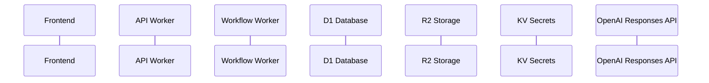
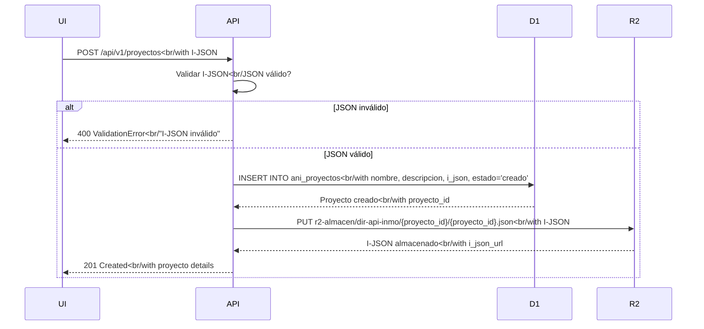
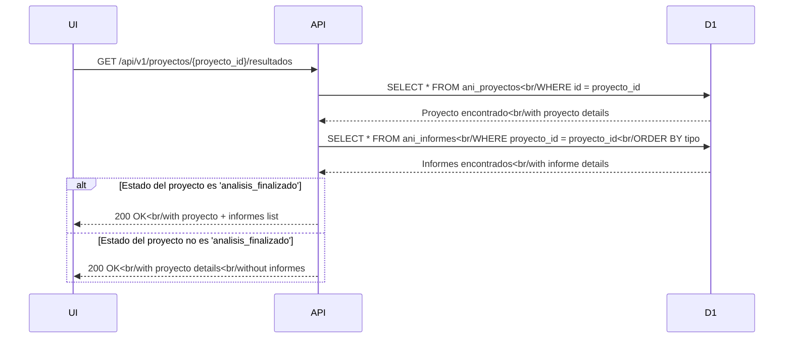
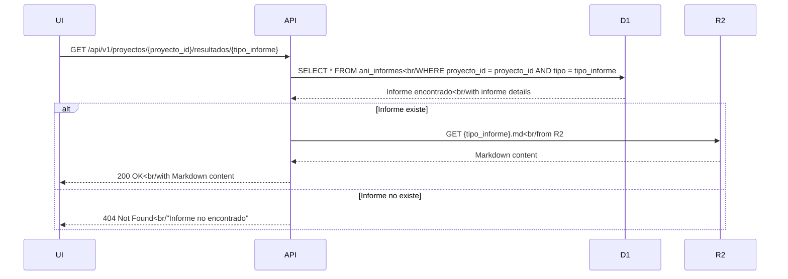
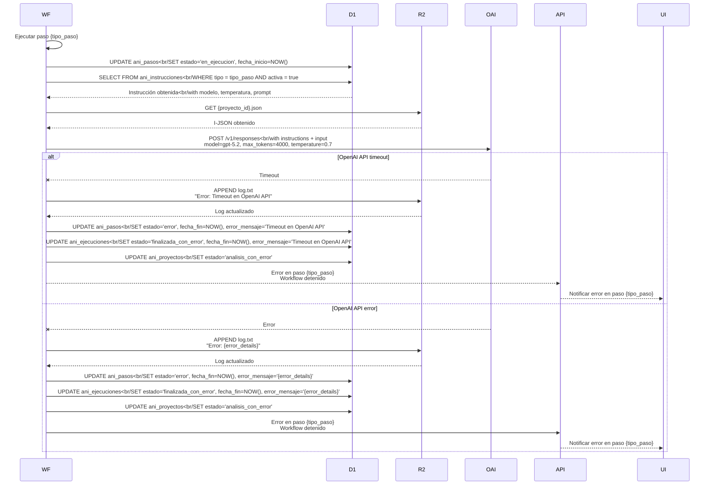
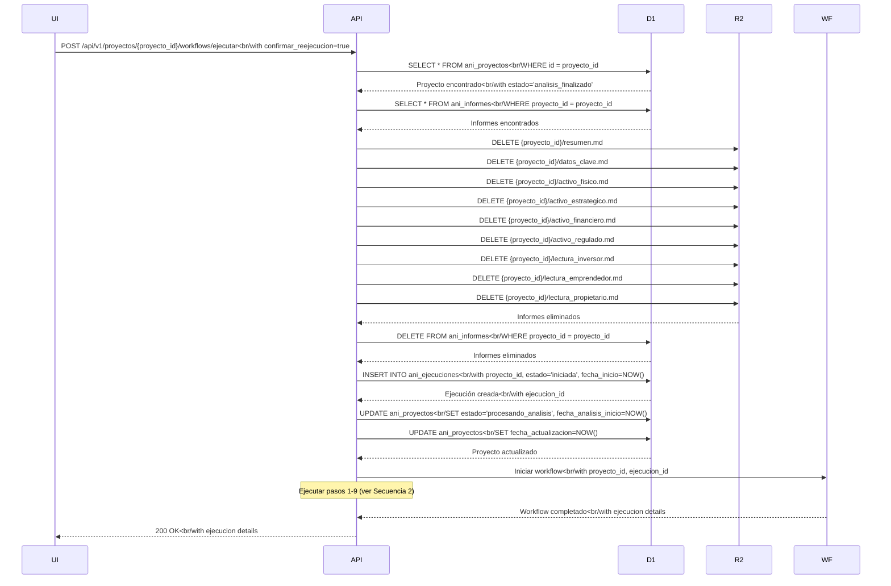
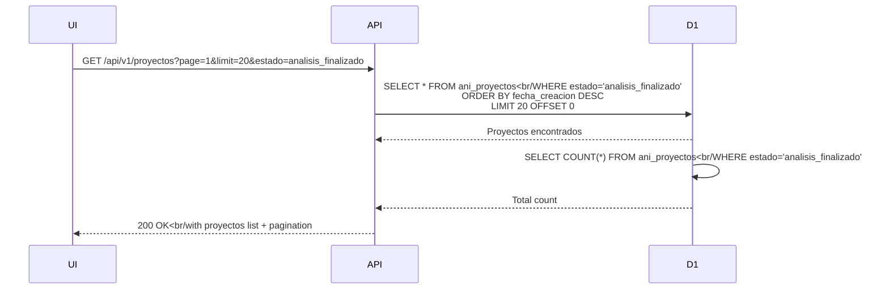
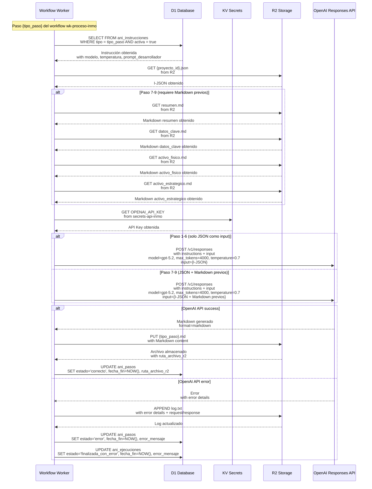

# Diagramas de Secuencia

> **Documento:** FASE 3 — Diseño
> **Fuente principal:** [`02 api-contract.md`](../fase02/02%20api-contract.md)
> **Versión:** 1.1
> **Fecha:** 2026-03-18
> **Cambio:** Actualizados diagramas para reflejar integración con OpenAI Responses API usando Cloudflare Workflows

---

## Resumen

Este documento describe las secuencias de interacción entre componentes para los flujos principales definidos en la especificación funcional.

---

## Convenciones



---

## Secuencia 1: Crear Proyecto desde I-JSON



---

## Secuencia 2: Ejecutar Workflow de Análisis

```mermaid
sequenceDiagram
    UI->>API: POST /api/v1/proyectos/{proyecto_id}/workflows/ejecutar<br/with confirmar_reejecucion
    API->>API: Validar estado del proyecto<br/estado is 'creado' or 'analisis_con_error'?
    alt Estado inválido
        API-->>UI: 400 ValidationError<br/"Proyecto no está en estado válido"
    else Estado válido
        alt Tiene análisis previos?
            API->>UI: ¿Confirmar reejecución?
            alt Usuario cancela
                UI--xAPI: Usuario cancela
            else Usuario confirma
                API->>D1: INSERT INTO ani_ejecuciones<br/with proyecto_id, estado='iniciada', fecha_inicio=NOW()
                D1-->>API: Ejecución creada<br/with ejecucion_id
                API->>D1: UPDATE ani_proyectos<br/SET estado='procesando_analisis', fecha_analisis_inicio=NOW()
                D1-->>API: Proyecto actualizado
                API-->>UI: 200 OK<br/with ejecucion_id
                API->>WF: Iniciar workflow wk-proceso-inmo<br/with proyecto_id, ejecucion_id
                WF->>WF: Crear 9 pasos en estado 'pendiente'
                WF-->>API: Workflow iniciado<br/with ejecucion details
                loop Para cada paso (1-9)
                    WF->>WF: Actualizar estado paso a 'en_ejecucion'
                    WF->>D1: UPDATE ani_pasos<br/SET estado='en_ejecucion', fecha_inicio=NOW()
                    WF->>D1: SELECT FROM ani_instrucciones<br/WHERE tipo = tipo_paso AND activa = true
                    D1-->>WF: Instrucción obtenida<br/with modelo, temperatura, prompt
                    WF->>R2: GET {proyecto_id}.json<br/from R2
                    R2-->>WF: I-JSON obtenido
                    alt Paso 7-9 (requiere Markdown previos)
                        WF->>R2: GET {tipo_paso_previo}.md<br/from R2
                        R2-->>WF: Markdown previos obtenidos
                    end
                    WF->>OAI: POST /v1/responses<br/with instructions + input<br/>model=gpt-5.2, max_tokens=4000, temperature=0.7
                    alt OpenAI API success
                        OAI-->>WF: Markdown generado
                        WF->>R2: PUT {tipo_paso}.md<br/with Markdown content
                        R2-->>WF: Archivo almacenado<br/with ruta_archivo_r2
                        WF->>D1: UPDATE ani_pasos<br/SET estado='correcto', fecha_fin=NOW(), ruta_archivo_r2
                    else OpenAI API error
                        WF->>R2: APPEND log.txt<br/with error details
                        R2-->>WF: Log actualizado
                        WF->>D1: UPDATE ani_pasos<br/SET estado='error', fecha_fin=NOW(), error_mensaje
                        WF->>D1: UPDATE ani_ejecuciones<br/SET estado='finalizada_con_error', fecha_fin=NOW(), error_mensaje
                        WF->>API: Error en paso {tipo_paso}<br/with error details
                        API-->>UI: Notificar error en paso {tipo_paso}
                end
                alt Todos los pasos completados sin errores
                    WF->>D1: UPDATE ani_proyectos<br/SET estado='analisis_finalizado', fecha_analisis_fin=NOW()
                    WF->>D1: UPDATE ani_ejecuciones<br/SET estado='finalizada_correctamente', fecha_fin=NOW()
                    WF-->>API: Workflow completado<br/with ejecucion details
                    API-->>UI: 200 OK<br/with ejecucion details
                end
        end
    end
```

---

## Secuencia 3: Consultar Resultados de Análisis



---

## Secuencia 4: Obtener Informe Específico



---

## Secuencia 5: Manejo de Errores en Workflow



---

## Secuencia 6: Reejecución de Workflow



---

## Secuencia 7: Listar Proyectos



---

## Secuencia 8: Integración con OpenAI Responses API



---

## Leyenda de Componentes

| Componente | Descripción |
|-----------|-------------|
| **Frontend** | Interfaz web (React) que interactúa con el usuario |
| **API Worker** | Worker de Cloudflare que expone endpoints REST |
| **Workflow Worker** | Cloudflare Workflow que ejecuta el análisis secuencial |
| **D1 Database** | Base de datos SQLite de Cloudflare para persistencia (proyectos, ejecuciones, pasos, instrucciones) |
| **R2 Storage** | Almacenamiento de objetos de Cloudflare para archivos (I-JSON, informes Markdown, logs) |
| **KV Secrets** | Almacenamiento de claves-valor de Cloudflare para secrets (OPENAI_API_KEY) |
| **OpenAI Responses API** | API de inferencia con IA para generar informes (model=gpt-5.2, max_tokens=4000, temperature=0.7) |

---

## Leyenda de Estados

| Estado | Descripción |
|---------|-------------|
| `creado` | Proyecto creado, listo para ejecutar análisis |
| `procesando_analisis` | Análisis en ejecución |
| `analisis_con_error` | Análisis completado con errores |
| `analisis_finalizado` | Análisis completado exitosamente |

---

> **Nota:** Estos diagramas de secuencia están basados en [`01 feature-workflow-analisis.spec.md`](../fase02/01%20feature-workflow-analisis.spec.md), [`02 api-contract.md`](../fase02/02%20api-contract.md), [`03 domain-model.md`](../fase02/03%20domain-model.md) y [`01 architecture.md`](./01%20architecture.md) como fuentes principales. Actualizados para reflejar la integración con OpenAI Responses API usando Cloudflare Workflows (workflow: wk-proceso-inmo, modelo: gpt-5.2, max_tokens: 4000, temperature: 0.7).
